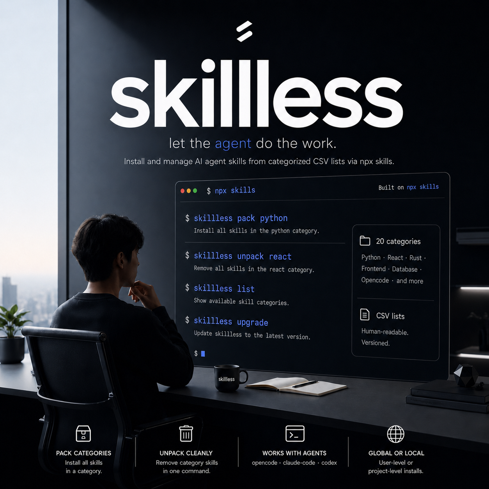

<div align="center">
  
</div>

# skillless

Install and manage AI agent skills from categorized CSV lists via `npx skills`.

> One command to pack an entire skill set — Python, React, Rust, or any of 23 categories — into your agent config.

## What it does

`skillless` wraps [`npx skills`](https://github.com/anthropics/skills) with category-based CSV lists so you can install,
update, and remove groups of skills in one shot instead of running `npx skills add` for each one individually.

It also includes local skills that can be packed from this repository. **Fabled** is a six-phase workflow skill for
non-trivial one-shot build requests: reconstruct intent, decide scope, design first, build completely, verify, then
deliver something a human can run or use.

```
skillless pack python                    # install all Python skills
skillless pack default frontend backend  # install multiple categories at once
skillless unpack react                   # remove all React skills
skillless list                           # show available categories
skillless upgrade                        # self-update to latest version
```

## Quick start

```bash
# 1. Clone this repo
git clone <repo-url> && cd skillless

# 2. Make it executable and add to your shell
chmod +x skillless
echo 'alias skillless="$(pwd)/skillless"' >> ~/.zshrc
source ~/.zshrc

# 3. Install a category
skillless pack python
```

> [!NOTE]
> Requires `npx` (Node.js/npm) and Bash 4+.

## Commands

| Command                          | Description                                            |
|----------------------------------|--------------------------------------------------------|
| `pack <category\|all>...`        | Install one or more categories (space-separated)       |
| `unpack <category\|all>...`      | Remove one or more categories (space-separated)        |
| `list`                   | Show available categories and skill counts |
| `upgrade`                | Update skillless to the latest version     |
| `help`                   | Show usage information                     |

## Options

| Option                        | Description                          |
|-------------------------------|--------------------------------------|
| `-s, --scope <global\|local>` | Install scope (default: `global`)    |
| `-n, --dry-run`               | Print commands without running them  |
| `-v, --verbose`               | Show raw `npx skills` output         |
| `--skip-update`               | Skip the staleness check (pack only) |
| `-d, --lists-dir <dir>`       | Custom category CSV directory        |

## Available categories

| Category     | Skills | Category   | Skills |
|--------------|--------|------------|--------|
| default      | 35     | kotlin     | 6      |
| database     | 13     | laravel    | 5      |
| swift        | 9      | nest       | 5      |
| java         | 8      | prisma     | 3      |
| frontend     | 5      | react      | 3      |
| python       | 6      | rust       | 3      |
| typescript   | 4      | backend    | 3      |
| django       | 3      | cpp        | 3      |
| go           | 3      | android    | 2      |
| experimental | 2      | stock      | 1      |
| opencode     | 1      | cli        | 2      |
| mcp          | 2      |            |        |

Use `skillless list` for the current counts.

## Install scope

**Global** (default) — skills go into your user-level agent config (`~/.agents/skills/`, `~/.claude/skills/`, etc.).

```bash
skillless pack python                   # single category
skillless pack default frontend backend # multiple categories
```

**Local** — skills are vendored into the current project's `.agents/skills/` directory, versioned with the repo.

```bash
skillless -s local pack python                   # single category, project-level
skillless -s local pack default frontend backend # multiple categories, project-level
```

## CSV format

Each `.csv` in `lists/` has three columns:

```csv
repo,skill_name,agents
affaan-m/everything-claude-code,python-patterns,opencode claude-code codex
anthropics/skills,pdf,
wshobson/agents,
```

| Column       | Required | Description                                                         |
|--------------|----------|---------------------------------------------------------------------|
| `repo`       | Yes      | GitHub repo (`owner/repo`)                                          |
| `skill_name` | No       | Specific skill to install. Empty = install all skills from the repo |
| `agents`     | No       | Target agents (`opencode claude-code codex`). Empty = auto-detect   |

## Project structure

```
skillless           # Main CLI entrypoint
lists/              # Category CSV files (23 categories)
  default.csv       # Cross-cutting skills (36 entries)
  python.csv        # Python-specific skills
  cli.csv           # CLI tooling skills
  mcp.csv           # MCP server skills
  ...
scripts/
  install-skills.sh # Worker that processes CSV rows via npx skills
skills/
  fabled/           # Local six-phase build discipline skill
skills-lock.json    # Lockfile tracking installed skill sources and hashes
```

## How it works

1. `skillless pack <category>` reads the matching CSV from `lists/`
2. For each row, it checks if the skill is already installed (skips if up to date)
3. Runs `npx skills add <repo> -s <skill> -y` for each entry
4. After installing new skills, batch-updates existing ones to check for newer versions
5. Reports a summary: installed, updated, skipped, failed

The install worker handles ANSI output parsing, security risk display (Gen, Socket, Snyk), agent detection, and error
reporting — so you get clean, actionable output.

## License

[MIT](LICENSE.md)
