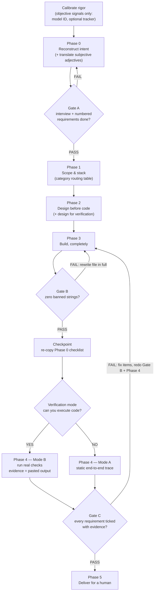

# Fabled workflow — diagram (human-facing documentation only)

The model-facing instructions in `SKILL.md` deliberately carry the gates as plain
"IF condition → action" text: graph syntax adds symbol-tracking overhead that weak
models handle poorly. This diagram exists only for humans reading the skill.

